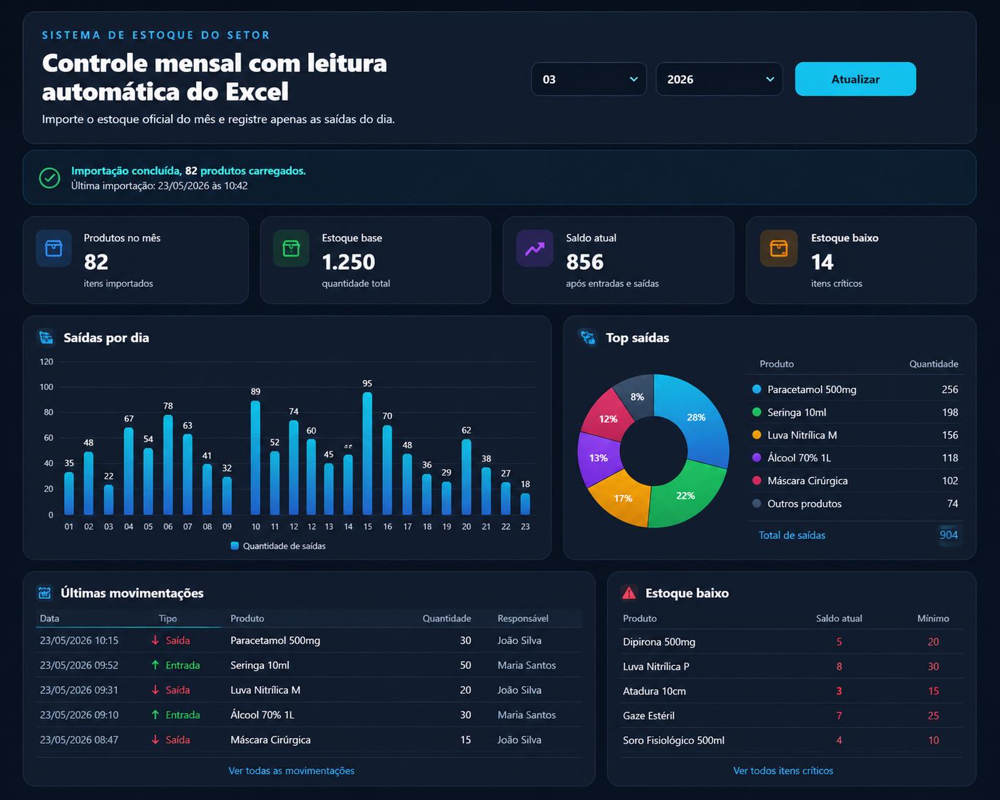

# Sistema de Gestão de Estoque

Sistema web completo para controle de estoque com importação de dados, registro de movimentações e visualização em tempo real.

---

## 🚀 Tecnologias

* React + Vite
* Tailwind CSS
* Node.js + Express
* Prisma ORM
* SQLite

---

## 📊 Funcionalidades

* Importação automática de planilhas Excel
* Cadastro e gerenciamento de produtos
* Registro de entradas e saídas
* Cálculo automático de saldo
* Dashboard com visão geral do estoque

---

## 🔄 Fluxo do Sistema

1. Importação da planilha mensal
2. Armazenamento do estoque base
3. Registro das movimentações ao longo do mês
4. Atualização automática do saldo

---

## ▶️ Como rodar o projeto

### 🔧 Backend

```bash
cd backend
cp .env.example .env
npm install
npx prisma generate
npx prisma db push
npm run dev
```

Backend disponível em:
http://localhost:3333

---

### 💻 Frontend

```bash
cd frontend
npm install
npm run dev
```

Frontend disponível em:
http://localhost:5173

---

## 📸 Preview

### Sistema completo com importação de Excel e visualização em tempo real:



---

## 📌 Objetivo

Projeto desenvolvido com foco em simular um sistema real de gestão de estoque utilizado em ambientes corporativos.

---

## 🔧 Próximas melhorias

* Autenticação de usuários
* Geração de relatórios (PDF/Excel)
* Filtros avançados
* Alertas de estoque mínimo
